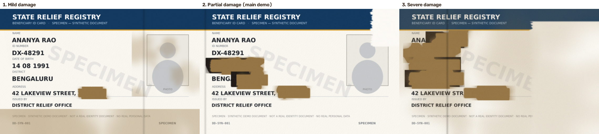
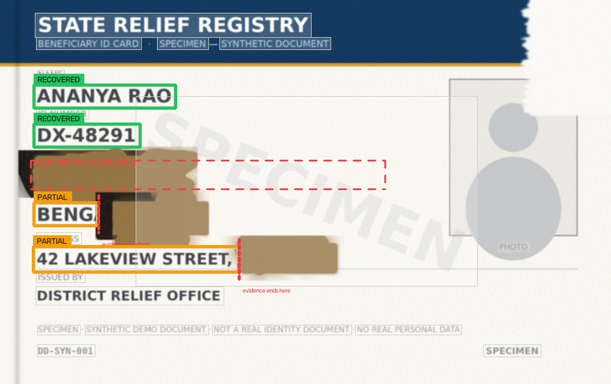
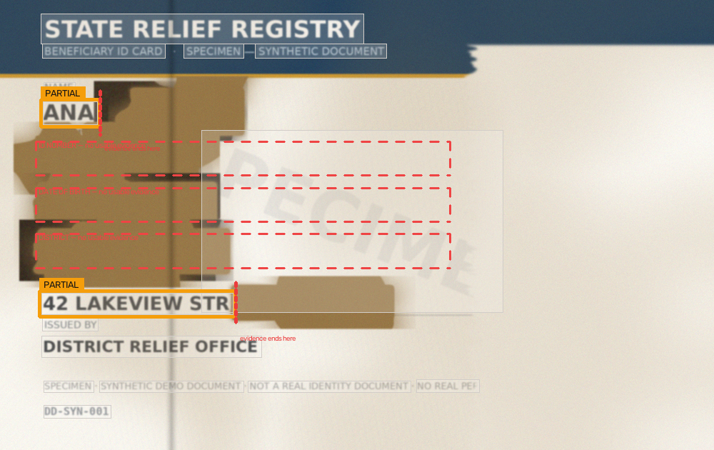

# DisasterDoc

**Evidence-first recovery for damaged documents.**

> ### If the document doesn't show it, DisasterDoc doesn't claim it.

DisasterDoc reads a damaged document, extracts only what the visible evidence actually
supports, explicitly marks what it cannot establish, and hands a human a verification
queue instead of a set of guesses.

It is **not** an AI that guesses what a damaged document says. It is an evidence
management and recovery-assistance tool that refuses to complete information it cannot
see.

---

## 1. The problem

After floods, fires, earthquakes and cyclones, the documents people need most — identity
cards, registration papers, beneficiary records — are often the first things damaged.
Wet paper blurs, tears remove whole lines, flood silt stains, and heat chars text into
illegibility.

The people who need these documents are usually the ones least able to prove who they
are by other means. Recovery schemes stall exactly where the paper failed.

## 2. Why plain OCR is not enough

Running OCR on a damaged document gives you text with no account of what is missing:

- a truncated `BENG` has no way of telling you that eight characters were printed there;
- a low-confidence `DX-48291` looks identical to a high-confidence one once it is a string;
- an empty result for a wrecked field is indistinguishable from "this document has no
  such field".

OCR output is **machine-observed evidence, not truth**. The failure mode is silence: the
consumer of that text cannot tell a complete reading from a fragment of one.

## 3. Why multimodal AI makes this worse, not better

A multimodal model shown a document with `BENG` on it will very often answer
`Bengaluru` — confidently, fluently, and in the same font as the parts of the report that
*are* supported by evidence.

That single step is where a recovery assistance tool turns into a liability:

- A plausible inference is not a fact, but once it is rendered next to recovered fields
  it is indistinguishable from one.
- A caseworker under pressure copies it into a form, and the guess becomes an
  administrative fact nobody can trace back to the paper.
- When the inference is wrong — and for a truncated field it is a guess — the person who
  suffers is the applicant whose record it now contradicts.

A completed guess is more dangerous than an acknowledged gap, because the gap is visible
and the guess is not.

## 4. DisasterDoc's approach

DisasterDoc separates **what the document shows** from **what a model might assume**,
and keeps them in different layers, different fields and different parts of the report.

```
                OBSERVATION
                     ↓
      DETERMINISTIC FACT CLASSIFICATION
                     ↓
              AI COMMENTARY
```

and never:

```
                OBSERVATION
                     ↓
                 AI GUESS
                     ↓
                  FACT
```

Three rules make that separation real rather than rhetorical:

1. **Only deterministic code assigns a status or a claimed value.** Regexes, template
   regions, bounding-box geometry and a pixel-level damage map. See `src/classifier.py`.
2. **A PARTIAL or UNRECOVERABLE field has `claimed_value: null`.** The legacy JSON
   `value` alias remains null too. An observed fragment is never promoted into a claim,
   no matter how convincing it looks. This is asserted in the test suite.
3. **The AI layer can only write into one slot.** `ai_commentary`. Attempts to return an
   observation, claim, status, reason code, validation or damage evidence are ignored and
   logged by key in `ai_guardrail_notes`. The app runs the pipeline without an AI key.

The AI is used for wording: explaining why a field is partial, phrasing a verification
instruction, and listing possible readings of a fragment in a slot labelled
**POSSIBILITIES — NOT DOCUMENT EVIDENCE**.

## 5. Architecture

```
              DAMAGED DOCUMENT
                     │
                     ▼
             IMAGE PREPROCESSING
                     │
                     ▼
                    OCR
                     │
        ┌────────────┴────────────┐
        │                         │
   OCR TEXT                  BOUNDING BOX
   + confidence              + coordinates
        │                         │
        └────────────┬────────────┘
                     ▼
             EVIDENCE LAYER
                     │
                     ▼
          DETERMINISTIC RULES
                     │
       ┌─────────────┼─────────────┐
       ▼             ▼             ▼
   RECOVERED      PARTIAL     UNRECOVERABLE
       │             │             │
       └─────────────┼─────────────┘
                     ▼
             HUMAN VERIFICATION
                     │
                     ▼
              AI COMMENTARY
                     │
                     ▼
             EVIDENCE REPORT
```

Mapped to files:

| Stage | Module | What it does |
|---|---|---|
| Provenance | `src/hashing.py` | SHA-256 of the exact uploaded file |
| Image preprocessing | `src/preprocessing.py` | decode, downscale, grayscale, CLAHE, denoise — never "restore" |
| OCR | `src/ocr.py` | verbatim text + bbox + engine confidence per observation |
| Surface damage | `src/damage.py` | where the page has no legible structure (pixels, not models) |
| Field mapping | `src/fields.py` | label anchors, row bands, OCR line merging |
| Classification | `src/classifier.py` | RECOVERED / PARTIAL / UNRECOVERABLE + reasons |
| Evidence assembly | `src/evidence.py` | evidence document, annotated image, verification queue |
| AI commentary | `src/ai_commentary.py` | Gemini, advisory only, guardrailed |
| Reports | `src/report.py` | JSON + PDF evidence reports |
| Orchestration | `src/pipeline.py` | the sequence above, with per-stage status |
| UI | `app.py` | Streamlit interface |

## 6. What the statuses mean

| Status | Meaning | `claimed_value` (`value` legacy alias) |
|---|---|---|
| 🟢 **RECOVERED** | A complete OCR transcription passes the current format, truncation, readability, and evidence-quality checks. Conflicting usable readings over overlapping pixels are not recovered. | the transcription, copied verbatim from OCR evidence |
| 🟡 **PARTIAL** | Some usable evidence exists, but the complete value cannot safely be established — for example, a fragment, damage, low OCR confidence, or conflicting overlapping OCR readings. | `null`; `observed_value` may still contain a fragment |
| 🔴 **UNRECOVERABLE** | There is no usable evidence for the field: the area is unreadable, no observation overlaps the value region, or only sub-threshold observations were found. | `null` |

`RECOVERED` is an OCR transcription, not independent verification of source-record correctness,
identity, or document authenticity. A structural `PASS` is not truth evidence.

Each JSON field result exposes `observed_value`, `claimed_value`, `status`, `reason_codes`,
OCR/damage/validation evidence and compatibility aliases. The document carries evidence-schema,
code, configuration and template versions. Stable reason codes are the primary machine-readable
explanation; the existing detailed text is retained for compatibility. See
[`docs/evidence_contract.md`](docs/evidence_contract.md) for the contract and migration notes.

The rules are in one place (`src/classifier.py`) and every decision is recorded with
stable codes plus plain-language details, so a reviewer can audit *why* a field was downgraded.

**The thresholds are heuristics, not statistics.** They come from OCR output and pattern
matching. DisasterDoc performs no statistical validation and reports no probability that
a value is correct.

## 7. OCR confidence vs. evidence confidence vs. status

Three different things, deliberately kept apart on screen and in the JSON:

- **OCR confidence** — the engine's own score for a box of pixels, e.g. `0.71`.
- **Evidence confidence bucket** — a transparent heuristic (`high` / `medium` / `low` /
  `none`) over how well the *field* survived: pattern satisfaction, truncation, adjacent
  damage, obscuration, engine confidence.
- **Field status** — `RECOVERED` / `PARTIAL` / `UNRECOVERABLE`.

The UI never renders anything like `Bengaluru: 94% confidence`, because that number would
imply a validation that does not exist.

## 8. Demo documents

Three synthetic documents, generated by `tools/make_demo_docs.py` and committed to
`demo/`. They are fictional: a "State Relief Registry" beneficiary card for a person who
does not exist, watermarked **SPECIMEN**, with no real personal data and no resemblance
to any real identity document.



| Demo | Damage | Result |
|---|---|---|
| `mild_damage.png` | addressing tail washed out | Name / ID / DOB / District 🟢, Address 🟡 |
| `partial_damage.png` | **main demo** — district truncated, DOB destroyed | Name 🟢, ID 🟢, District 🟡 `BENG`, DOB 🔴, Address 🟡 |
| `severe_damage.png` | charring, tearing, flood silt | Name 🟡 `ANA`, ID 🔴, DOB 🔴, District 🔴, Address 🟡 |

The generator is deterministic (fixed seeds), so the demo reproduces byte-for-byte — the
test suite asserts this.

## 9. Demo workflow

1. Open the app and pick **2 · Partial damage** (or upload `demo/partial_damage.png`).
2. Watch the real pipeline stages report as they finish — a stage marked ✕ never affects
   the deterministic results.
3. Read the annotated document: green evidence boxes, red dashed regions with **no usable
   evidence**, and a red marker showing exactly **where the evidence ends**.
4. Read the field cards: `NAME 🟢 ANANYA RAO`, `ID NUMBER 🟢 DX-48291`,
   `DISTRICT 🟡 BENG`, `DATE OF BIRTH 🔴 No sufficient evidence`.
5. Click **Inspect evidence** on District. The panel shows the observed fragment, the OCR
   confidence, the bounding box, and why the field was downgraded. The document highlights
   the corresponding region.
6. If AI commentary is enabled, the possible interpretations appear under
   **⚠ POSSIBILITIES — NOT DOCUMENT EVIDENCE**, together with a suggested verification —
   while the field's `value` stays `null`.
7. Work the **Verification required** checklist.
8. Export the JSON and PDF evidence reports.





## 10. Technology stack

| Layer | Choice | Why |
|---|---|---|
| App | Python + Streamlit | fastest path to a demoable, reviewable UI |
| OCR | EasyOCR (CPU) | gives text + bbox + confidence per observation out of the box |
| Image processing | OpenCV + Pillow | decode, preprocess, damage map, annotation, demo generation |
| Deterministic logic | regex, geometry, templates | auditable, testable, no training |
| AI commentary | Gemini (`google-genai`) | used only for wording; optional |
| Reports | `json` + ReportLab | machine-readable record + printable report |
| Hashing | `hashlib.sha256` | file-level provenance |

Pinned in `requirements.txt`. OCR weights (~94 MB) download on first use into
`~/.cache/easyocr` (override with `DD_MODEL_CACHE`) rather than the repository.

## 11. Privacy and scope

- Uploaded documents are **processed in memory** for the session and are not written to
  disk by the app. PNG, JPEG, WebP, BMP, and TIFF signatures are checked before decoding;
  uploads are capped at 25 MiB, 25 million pixels, and 10,000 pixels per dimension.
- Processing is local; the **only** outbound request is optional AI commentary, which is
  **off by default**. If explicitly enabled, the request contains incomplete OCR text,
  field labels/status/reasons, deterministic validation results/evidence (including
  competing readings and their boxes/scores when present), the expected format, a
  SHA-256 document ID, and an obscured-area fraction — **never the source image**. `.env`
  is read locally without overriding environment variables; keep API keys out of source
  control.
- No government database is queried, no identity is verified, no replacement document is
  generated, no legal validity is claimed.
- Demo mode uses synthetic documents only.

## 12. Provenance and the document ID

The UI and both reports show:

```
Document ID
SHA-256: 3729370a4763103be41af00172034b2b3f5f29fd6de9257dada2752593335ec1
```

This identifies the exact file that was processed, so a report can be tied to a specific
upload. **It does not prove the document is authentic, unaltered, or legally valid** — a
hash of a forgery is still a hash of a forgery, and this is stated in the report itself.

## 13. Limitations

- **One template.** `synthetic_id_v1` with five fields. Field mapping relies on fixed
  relative regions, so other layouts are not supported.
- **No rotation or perspective correction.** A skewed photograph degrades the row-band
  geometry. Preprocessing deliberately stays conservative rather than warping the image
  in ways that would change what the evidence looks like.
- **Damage detection is a pixel heuristic.** Very textured paper, heavy shadows, or a dark
  background can be misread as damage (which downgrades fields toward PARTIAL — the safe
  direction) or, less often, hide damage.
- **Handwriting is not supported** by the OCR configuration used here.
- **Heuristic thresholds, no statistical validation.** The buckets are transparent, not
  calibrated; OCR confidence is not a correctness probability.
- **Synthetic evaluation only.** Phase 2 characterized 33 controlled classifier inputs;
  Phase 3 ran a 40-case, 10-source image-level pilot through EasyOCR and the full
  pipeline. Phase 3 initially had 11 source-label false recoveries; Phase 5 rejected one
  impossible calendar date, leaving 10. Every residual Phase 3 reading matches deliberately
  altered visible image text and differs from the original source value. Phase 2 has no
  image/OCR evidence. These findings do not estimate real-world OCR accuracy. See the
  Phase 2/3 methodology docs and `docs/phase_6_report.md` for label scope and denominators.
- **AI commentary is optional and off by default.** A Gemini API key is required when a
  user explicitly enables it; without one, the deterministic pipeline remains available.
  The configured `DD_AI_TIMEOUT` value is not yet applied to the SDK request.
- The classifier decides from a single document; it has no cross-document or registry
  context, by design.

## 14. SDG alignment

**Primary — UN SDG 16 (Peace, Justice and Strong Institutions), Target 16.9: legal
identity for all.** DisasterDoc targets one specific blockage in identity recovery: a
document that exists but can no longer be read. Its contribution is negative but
important — it prevents a recovery process from *fabricating* the identity data it is
supposed to be recovering, and it makes the gap auditable.

**Secondary — UN SDG 11 (Sustainable Cities and Communities).** Disaster resilience
includes the ability to rebuild administrative records after an event. Making damaged
document processing explicit about uncertainty reduces the losses caused by unreadable
critical documents and gives relief offices a defensible record of what was and was not
legible.

No other SDG is claimed.

## 15. Installation

```bash
git clone <repo> && cd disasterdoc
python -m venv .venv && source .venv/bin/activate     # Windows: .venv\Scripts\activate
pip install -r requirements.txt
cp .env.example .env                                   # optional: add GEMINI_API_KEY
```

## 16. Running locally

```bash
streamlit run app.py
```

Then open <http://localhost:8501>. The first run downloads the OCR weights once
(~94 MB) and the first document analysis takes a few seconds while they load.

Regenerate the demo documents or the README figures:

```bash
python tools/make_demo_docs.py     # deterministic synthetic demo documents
python tools/make_figures.py       # README figures + sample JSON/PDF reports
```

Run the test suite:

```bash
pytest -q
```

The suite covers expected statuses for OCR-stable demo fields, a safety assertion for
live DOB OCR output, the `value = null` invariant, raw-OCR preservation, bounding boxes
inside the image, classification identical with AI disabled, AI guardrails rejecting
factual writes, hash provenance, verification-queue coverage, JSON/PDF export, upload
signature/size/pixel/decompression-bomb checks, HTML/PDF escaping, bounded session results,
AI opt-in defaults, invalid input handling, deterministic classifier cases, the versioned
observed/claimed evidence and reason-code contract, image-level evaluation integrity, and
same-seed demo reproducibility in isolated temporary directories, competing OCR-reading
abstention, and separately timed OCR/image stages. The Phase 5 baseline was **98 passed, 1
strict XFAIL, 20 warnings**; Phase 6's full suite reported **106 passed, 1 strict XFAIL,
20 warnings** in 187.43 s. The security suite reported **14 passed**. The strict expected
failure documents a known limitation: a single high-confidence, format-valid identifier
substitution is not detected by the single-pass classifier. Phase 5 added calendar-valid
DOB checking; Phase 6 adds conservative overlapping-reading handling. Neither validates
source-record truth. See `docs/phase_6_report.md` for exact environment and commands.

## 17. Configuration

| Variable | Default | Purpose |
|---|---|---|
| `GEMINI_API_KEY` | *(unset)* | enables the optional AI commentary layer |
| `DD_GEMINI_MODEL` | `gemini-2.5-flash` | commentary model |
| `DD_AI_TIMEOUT` | `25` | reserved config value; it is not currently enforced by the Gemini SDK request |
| `DD_MODEL_CACHE` | `~/.cache/easyocr` | where OCR weights are cached |
| `DD_OCR_ENGINE` | `EasyOCR` | OCR engine label recorded in the report |

No secret is hardcoded; `.env` is git-ignored.

## 18. Repository layout

```
disasterdoc/
├── app.py                      Streamlit UI (presentation only)
├── requirements.txt
├── .env.example
├── .streamlit/config.toml
├── src/
│   ├── config.py               template, thresholds, paths (single source of truth)
│   ├── hashing.py              SHA-256 provenance
│   ├── preprocessing.py        minimal image preparation for OCR
│   ├── ocr.py                  raw observations: text + bbox + confidence
│   ├── damage.py               surface-damage map
│   ├── fields.py               deterministic label/region field mapping
│   ├── classifier.py           RECOVERED / PARTIAL / UNRECOVERABLE + reasons
│   ├── validation.py           deterministic structural/calendar evidence
│   ├── evidence.py             evidence document, annotated image, verification queue
│   ├── ai_commentary.py        guardrailed Gemini commentary (optional)
│   ├── report.py               JSON + PDF evidence reports
│   └── pipeline.py             stage orchestration
├── demo/                       synthetic damaged documents (+ ground-truth masks)
├── evaluation/                 evaluation-only cases/results and synthetic assets
├── docs/                       audits, phase reports, and evaluation methodology
├── tools/
│   ├── make_demo_docs.py       demo document generator
│   ├── tune_demo_docs.py       damage-parameter sweep against real OCR
│   ├── run_image_level_evaluation.py  Phase 3 synthetic image-level runner
│   ├── analyze_phase6.py       frozen Phase 2/3/5 residual analysis (offline)
│   └── make_figures.py         README figures + sample reports
├── tests/                      production, security, UI, and evaluation tests
├── outputs/                    sample evidence reports
└── assets/                     README figures
```

## 19. Example evidence record

`outputs/sample_partial_damage_evidence.json` — the district field, verbatim:

```json
{
  "field_name": "district",
  "label": "DISTRICT",
  "expected_type": "string",
  "value": null,
  "raw_ocr_text": "BENG",
  "status": "PARTIAL",
  "confidence_bucket": "medium",
  "ocr_confidence": 1.0,
  "evidence": [
    {
      "observation_id": "obs_010",
      "bbox": [
        58,
        335,
        157,
        367
      ],
      "ocr_confidence": 1.0,
      "text": "BENG",
      "usable": true
    }
  ],
  "deterministic_reasons": [
    "Observed text is shorter than the template expects for this field (4 of at least 5 characters).",
    "Damage begins immediately after the observed text (obscured 87% of the next 35 px, unbroken run 31 px), so the printed value may continue into an unreadable area.",
    "The complete value cannot be established from this document, so no value is reported."
  ],
  "needs_verification": true,
  "verification_instruction": "Confirm the district directly with the applicant or through an independent supporting record.",
  "ai_commentary": {
    "possible_interpretations": [
      "Bengaluru",
      "Other"
    ],
    "verification_instruction": "Confirm the district directly with the applicant or through an independent supporting record.",
    "commentary": "Only a fragment of the district name survives, so the full value cannot be established from the document.",
    "ai_generated": true,
    "advisory_only": true,
    "guardrail": "Possibilities only - NOT document evidence. Never used to set status or value."
  }
}
```

`value` stays `null`. The AI layer's contribution lives in its own slot, labelled as
advisory, and is ignored by every part of the pipeline that decides facts.

> `ai_commentary` is `null` in the committed sample because no API key was configured in
> the build environment; the block above shows the shape it takes when Gemini is enabled.
>
> Note `ocr_confidence: 1.0` next to `status: "PARTIAL"`. The OCR engine was completely
> sure it read the four characters `BENG` — and it was right. That is exactly why OCR
> confidence cannot be used as a claim about the field: the engine scores the pixels it
> saw, not the characters it never saw. What makes the field partial is the damage
> beginning 0 px after the last glyph, not the confidence.

## 20. Design decisions worth calling out

- **A partial reading is not a value.** `raw_ocr_text` preserves `BENG`; `value` stays
  `null`. The fragment is evidence; the completion would be an invention.
- **Missing evidence is shown, not hidden.** Fields with no accepted observation render a
  red dashed region labelled "no usable evidence", so "we looked here and found nothing"
  is itself inspectable.
- **Truncation is detected from pixels, not from guesses.** If damage begins immediately
  after the surviving text, the field is downgraded even when the OCR text looks complete.
  On the main demo this is what stops `BENGI` from being reported as a district.
- **The annotation shows where evidence ends.** A red marker on the exact column where the
  readable text stops makes the reason for PARTIAL visible on the document.
- **Guardrails are logged, not just asserted.** An AI attempt to write `value` or `status`
  is recorded in `audit.ai_guardrail_notes`, so the separation can be verified at runtime
  instead of taken on trust.
- **Identifiers are treated more strictly than names.** For `id_number` and `dob`, a
  complete AI-suggested reading that satisfies the expected pattern is rejected outright,
  because every digit would be unverifiable. Descriptive fields may carry clearly labelled
  possibilities.

## 21. Future improvements

- Additional document templates and a template-selection step, with the same deterministic
  core underneath.
- Perspective/deskew correction with evidence boxes transformed alongside the image.
- A calibrated damage detector trained on labelled degraded documents, reported with real
  validation metrics instead of heuristic buckets — replacing, not dressing up, the current
  thresholds.
- Multi-page and multi-document evidence linking, so a caseworker can verify one field
  against a second damaged record.
- A reviewer-facing audit trail: who verified which field, when, and against what.
- Local/on-device commentary model to remove the last outbound network call.
- An accessibility pass on the exported PDF for use by relief offices in the field.

## 22. Disclaimer

> Confidence levels are heuristic and derived from OCR engine output and field-pattern
> matching. This tool does not perform statistical validation and its output requires
> human verification before use.

This MVP does not establish legal identity or document authenticity. It identifies the
exact file that was processed (SHA-256), it does not verify the document against any
registry, and it does not generate replacement documents. Demo documents are synthetic and
fictional.

---

**If the document doesn't show it, DisasterDoc doesn't claim it.**
